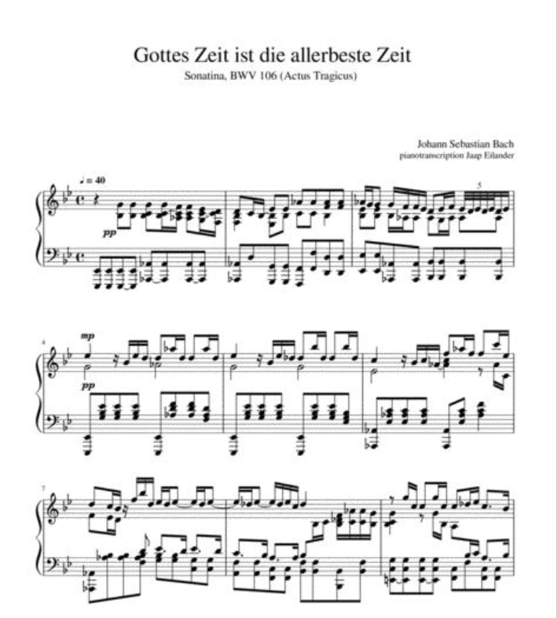

# Bach Chorales



### The data file

https://raw.githubusercontent.com/zacharski/ml-class/master/data/bach.zip


Note that the data file is a compressed zip file. You will need to download it, unzip it, and then load it into a Pandas DataFrame. I wanted to give you a bit of practice in getting data in a variety of formats.

### Chords

A chord in music is a set of notes played together. For example, if you play the notes C, E, and G together they would form a C major chord. If you played A, C, and E together, they would form an A minor chord. Your task is to predict the chord based on the notes played and several other features. The `chord_label` column is what you are predicting. When you see a capital M in that column, as in C_M that stands for major (in this case C major) and a small m represents minor, so G_m is G minor.

### Bach Chorales

The dataset is of Johann Sebastian Bach's chorales and cantatas. Bach was very prolific and over 1,000 of his works still survive (some believe he composed over 10,000 pieces). Because of this, scholars have associated a identification number to each existing composition. This number is called BWV which stands for Bach-Werke-Verzeichnis. The `choral_ID` column in the dataset refers to this number. For example, the first row of the dataset and a choral_ID of 000106b_, which   stands for BWV106. If you did a Google search on this you would see it refers to the cantata: *Gottes Zeit ist die allerbeste Zeit*. The next column in the dataset is `event_number` which refers to a unique position in that composition. These two columns should not be used for training. Starting with the next column are the 12 notes of a Western Scale: C, C#, D, D#, E, F, F#, G, G#, A, A#, B. A *yes* in the column indicates that that note is currently being played during the specific event. So the first row of the data indicates that a C, F, and A are being played. The `bass` column represents what note is being played in the bass and the meter column represents the meter (how many beats per measure). 

### Optional Bonus XP
If you want to try to obtain additional xp you need to divide the data intro training and testing using the following

```
bach.set_index('choral_ID', inplace=True)
bFeatures = bach.drop('chord_label', axis=1)
bLabels = bach['chord_label']
from sklearn.model_selection import train_test_split
bach_train_features, bach_test_features, bach_train_labels, bach_test_labels = train_test_split(bFeatures, bLabels, test_size = 0.2, random_state=42)
```

this will give everyone the same test set (`random_state=42` is what enables this)

Bonus:

bonus | criteria
:---: | :---:
10 | better than .85 accuracy on `accuracy_score(bach_test_labels, predictions)`
20 | third best in class
25 | second best in class
30 | first in class


